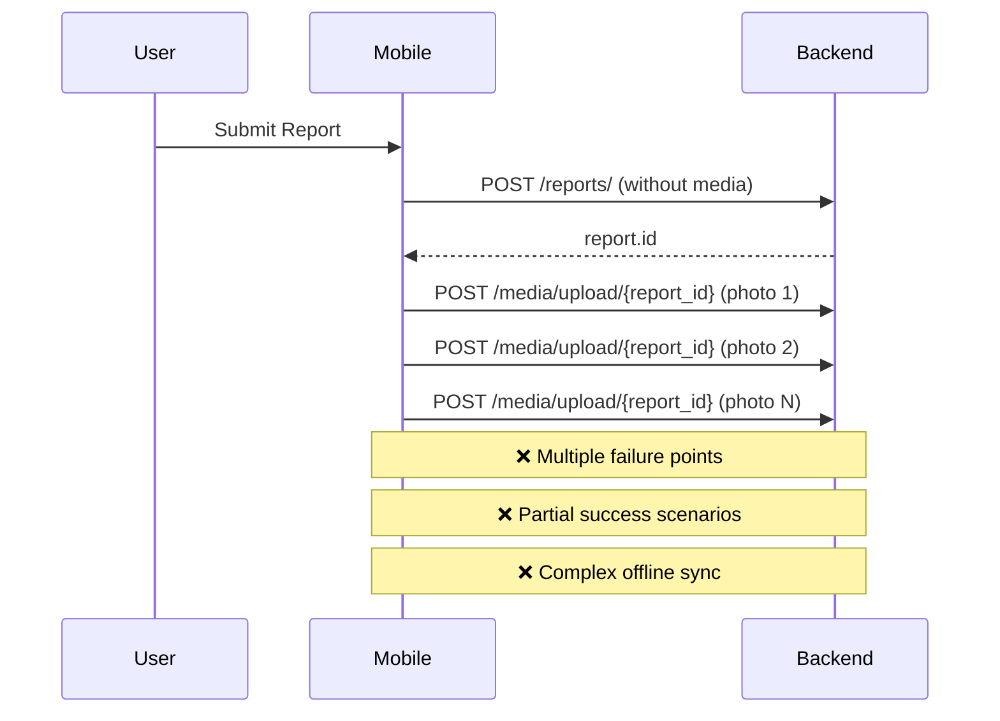
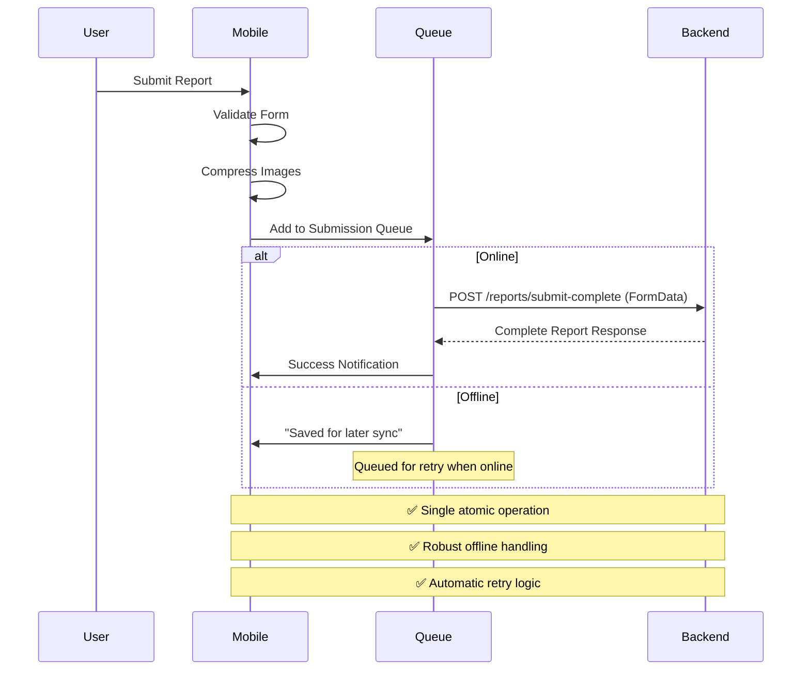

# Offline-First Report Submission - Production Ready Implementation Plan

## 🎯 **Objective**
Transform CivicLens report submission into a robust, offline-first architecture that handles network interruptions gracefully and provides excellent user experience whether online or offline.

## 📊 **Current State Analysis**

### **Problems Identified:**
1. **Non-Atomic Operations**: Report creation + media upload are separate API calls
2. **Poor Offline UX**: Complex multi-step process difficult to sync
3. **Race Conditions**: Media upload depends on report ID from first call
4. **Inconsistent Error Handling**: Different failure modes at each step
5. **Complex Sync Logic**: Offline sync tries to recreate multi-step process

### **Current Flow (Problematic):**


## 🚀 **Production-Ready Solution**

### **1. Single Atomic API Endpoint**

#### **New Endpoint: `POST /reports/submit-complete`**
```python
@router.post("/submit-complete", response_model=ReportResponse)
async def submit_complete_report(
    # Form data for report details
    title: str = Form(...),
    description: str = Form(...),
    category: str = Form(...),
    severity: str = Form(...),
    latitude: float = Form(...),
    longitude: float = Form(...),
    address: str = Form(...),
    landmark: Optional[str] = Form(None),
    is_public: bool = Form(True),
    is_sensitive: bool = Form(False),
    
    # File uploads (up to 5 images + 1 audio)
    files: List[UploadFile] = File(...),
    captions: Optional[str] = Form(None),  # JSON array of captions
    
    # Dependencies
    db: AsyncSession = Depends(get_db),
    current_user: User = Depends(get_current_user),
    upload_service: FileUploadService = Depends(get_file_upload_service)
):
    """
    Submit a complete report with all media files in a single atomic operation
    
    Benefits:
    - Single API call for complete submission
    - Atomic transaction (all succeed or all fail)
    - Better offline handling
    - Reduced complexity
    - Production-ready error handling
    """
```

### **2. Enhanced Mobile Implementation**

#### **New Submission Flow:**


## 🔧 **Implementation Details**

### **Backend Changes**

#### **1. New Complete Submission Endpoint**
```python
# app/api/v1/reports.py

@router.post("/submit-complete", response_model=ReportResponse)
async def submit_complete_report(
    title: str = Form(..., min_length=5, max_length=200),
    description: str = Form(..., min_length=10, max_length=2000),
    category: str = Form(...),
    severity: str = Form(..., regex="^(low|medium|high|critical)$"),
    latitude: float = Form(..., ge=-90, le=90),
    longitude: float = Form(..., ge=-180, le=180),
    address: str = Form(..., min_length=5, max_length=500),
    landmark: Optional[str] = Form(None, max_length=200),
    is_public: bool = Form(True),
    is_sensitive: bool = Form(False),
    
    # Media files
    files: List[UploadFile] = File(..., max_length=6),  # Max 5 images + 1 audio
    captions: Optional[str] = Form(None),  # JSON array
    
    # Dependencies
    request: Request,
    background_tasks: BackgroundTasks,
    db: AsyncSession = Depends(get_db),
    current_user: User = Depends(get_current_user),
    upload_service: FileUploadService = Depends(get_file_upload_service)
):
    """
    Submit complete report with media in single atomic transaction
    """
    async with db.begin():  # Atomic transaction
        try:
            # 1. Validate files
            await _validate_media_files(files)
            
            # 2. Create report
            report_data = ReportCreate(
                title=title.strip(),
                description=description.strip(),
                category=category,
                severity=ReportSeverity(severity),
                latitude=latitude,
                longitude=longitude,
                address=address.strip(),
                landmark=landmark.strip() if landmark else None,
                is_public=is_public,
                is_sensitive=is_sensitive
            )
            
            report = await _create_report_with_number(db, report_data, current_user.id)
            
            # 3. Upload and attach media files
            if files:
                media_list = await upload_service.upload_multiple_files(
                    files=files,
                    report_id=report.id,
                    user_id=current_user.id,
                    captions=json.loads(captions) if captions else []
                )
                
                # Update report with media count
                report.media_count = len(media_list)
            
            # 4. Queue for AI processing
            background_tasks.add_task(queue_report_for_processing_bg, report.id)
            
            # 5. Update user reputation
            background_tasks.add_task(update_user_reputation_bg, current_user.id, 5)
            
            # 6. Audit logging
            await _log_complete_submission(db, request, current_user, report)
            
            return _serialize_complete_report(report)
            
        except Exception as e:
            # Rollback handled by async with db.begin()
            logger.error(f"Complete submission failed: {e}")
            raise ValidationException(f"Submission failed: {str(e)}")

async def _validate_media_files(files: List[UploadFile]):
    """Validate media files before processing"""
    if len(files) > 6:
        raise ValidationException("Maximum 6 files allowed (5 images + 1 audio)")
    
    image_count = 0
    audio_count = 0
    
    for file in files:
        if not file.filename:
            raise ValidationException("All files must have filenames")
        
        ext = file.filename.lower().split('.')[-1]
        
        if ext in ['jpg', 'jpeg', 'png', 'webp']:
            image_count += 1
            if image_count > 5:
                raise ValidationException("Maximum 5 images allowed")
        elif ext in ['mp3', 'wav', 'm4a']:
            audio_count += 1
            if audio_count > 1:
                raise ValidationException("Maximum 1 audio file allowed")
        else:
            raise ValidationException(f"Unsupported file type: {ext}")
```

#### **2. Enhanced File Upload Service**
```python
# app/services/file_upload_service.py

class FileUploadService:
    async def upload_multiple_files_atomic(
        self,
        files: List[UploadFile],
        report_id: int,
        user_id: int,
        captions: List[str] = None
    ) -> List[Media]:
        """
        Upload multiple files in a single atomic operation
        All files succeed or all fail - no partial uploads
        """
        uploaded_media = []
        temp_files = []
        
        try:
            # 1. Process and validate all files first
            for i, file in enumerate(files):
                processed_file = await self._process_file(file)
                temp_files.append(processed_file)
            
            # 2. Upload all files to storage
            for i, (file, processed_file) in enumerate(zip(files, temp_files)):
                caption = captions[i] if captions and i < len(captions) else None
                
                media = await self._upload_single_file_atomic(
                    file=file,
                    processed_file=processed_file,
                    report_id=report_id,
                    user_id=user_id,
                    caption=caption
                )
                uploaded_media.append(media)
            
            return uploaded_media
            
        except Exception as e:
            # Cleanup any uploaded files on failure
            for media in uploaded_media:
                try:
                    await self._cleanup_uploaded_file(media.file_url)
                except:
                    pass
            raise
        finally:
            # Cleanup temp files
            for temp_file in temp_files:
                try:
                    os.unlink(temp_file.path)
                except:
                    pass
```

### **Mobile App Changes**

#### **1. Enhanced Submission Hook**
```typescript
// src/shared/hooks/useReportSubmission.ts

interface CompleteReportData {
  title: string;
  description: string;
  category: ReportCategory;
  severity: ReportSeverity;
  latitude: number;
  longitude: number;
  address: string;
  landmark?: string;
  photos: string[];
  is_public: boolean;
  is_sensitive: boolean;
}

export const useReportSubmission = () => {
  const [progress, setProgress] = useState<SubmissionProgress | null>(null);
  const { isOnline } = useNetwork();
  const { addToQueue } = useSubmissionQueue();

  const submitComplete = async (reportData: CompleteReportData) => {
    try {
      setProgress({ stage: 'preparing', message: 'Preparing submission...' });

      // 1. Validate data
      await validateReportData(reportData);

      // 2. Compress images
      setProgress({ stage: 'compressing', message: 'Compressing images...' });
      const compressedPhotos = await compressImages(reportData.photos);

      // 3. Create FormData for single API call
      const formData = new FormData();
      
      // Add report fields
      formData.append('title', reportData.title);
      formData.append('description', reportData.description);
      formData.append('category', reportData.category);
      formData.append('severity', reportData.severity);
      formData.append('latitude', reportData.latitude.toString());
      formData.append('longitude', reportData.longitude.toString());
      formData.append('address', reportData.address);
      formData.append('is_public', reportData.is_public.toString());
      formData.append('is_sensitive', reportData.is_sensitive.toString());
      
      if (reportData.landmark) {
        formData.append('landmark', reportData.landmark);
      }

      // Add compressed images
      for (let i = 0; i < compressedPhotos.length; i++) {
        const photo = compressedPhotos[i];
        formData.append('files', {
          uri: photo.uri,
          type: 'image/jpeg',
          name: `photo_${i}.jpg`,
        } as any);
      }

      // 4. Submit based on connectivity
      if (isOnline) {
        setProgress({ stage: 'submitting', message: 'Submitting report...' });
        
        const response = await apiClient.post('/reports/submit-complete', formData, {
          headers: {
            'Content-Type': 'multipart/form-data',
          },
          onUploadProgress: (progressEvent) => {
            const percentage = Math.round(
              (progressEvent.loaded * 100) / progressEvent.total
            );
            setProgress({
              stage: 'uploading',
              message: `Uploading... ${percentage}%`,
              percentage,
            });
          },
        });

        setProgress({ stage: 'complete', message: 'Report submitted successfully!' });
        return response.data;
      } else {
        // Offline: Add to queue
        const queueItem = await addToQueue({
          type: 'COMPLETE_REPORT_SUBMISSION',
          data: {
            ...reportData,
            compressedPhotos,
          },
          timestamp: Date.now(),
          retryCount: 0,
        });

        setProgress({ 
          stage: 'queued', 
          message: 'Saved offline. Will sync when online.' 
        });
        
        return { id: queueItem.id, offline: true };
      }

    } catch (error) {
      setProgress(null);
      throw error;
    }
  };

  return {
    submitComplete,
    progress,
    isOnline,
  };
};
```

#### **2. Robust Offline Queue System**
```typescript
// src/shared/services/queue/submissionQueue.ts

interface QueueItem {
  id: string;
  type: 'COMPLETE_REPORT_SUBMISSION';
  data: CompleteReportData & { compressedPhotos: CompressedImage[] };
  timestamp: number;
  retryCount: number;
  maxRetries: number;
  status: 'pending' | 'processing' | 'completed' | 'failed';
  error?: string;
}

class SubmissionQueue {
  private queue: QueueItem[] = [];
  private isProcessing = false;
  private retryDelays = [1000, 2000, 5000, 10000, 30000]; // Progressive delays

  async addToQueue(item: Omit<QueueItem, 'id' | 'status' | 'maxRetries'>): Promise<QueueItem> {
    const queueItem: QueueItem = {
      ...item,
      id: `queue_${Date.now()}_${Math.random().toString(36).substr(2, 9)}`,
      status: 'pending',
      maxRetries: 5,
    };

    // Save to local storage
    await this.saveToStorage(queueItem);
    this.queue.push(queueItem);

    // Try to process immediately if online
    if (networkService.isOnline()) {
      this.processQueue();
    }

    return queueItem;
  }

  async processQueue() {
    if (this.isProcessing || !networkService.isOnline()) {
      return;
    }

    this.isProcessing = true;

    try {
      const pendingItems = this.queue.filter(item => item.status === 'pending');

      for (const item of pendingItems) {
        try {
          await this.processItem(item);
        } catch (error) {
          await this.handleItemError(item, error);
        }
      }
    } finally {
      this.isProcessing = false;
    }
  }

  private async processItem(item: QueueItem) {
    item.status = 'processing';
    await this.updateStorage(item);

    try {
      // Create FormData for submission
      const formData = new FormData();
      
      // Add report fields
      Object.entries(item.data).forEach(([key, value]) => {
        if (key !== 'compressedPhotos' && value !== undefined) {
          formData.append(key, value.toString());
        }
      });

      // Add compressed photos
      item.data.compressedPhotos.forEach((photo, index) => {
        formData.append('files', {
          uri: photo.uri,
          type: 'image/jpeg',
          name: `photo_${index}.jpg`,
        } as any);
      });

      // Submit to backend
      const response = await apiClient.post('/reports/submit-complete', formData, {
        headers: { 'Content-Type': 'multipart/form-data' },
        timeout: 60000, // 60 second timeout
      });

      // Success
      item.status = 'completed';
      await this.updateStorage(item);
      await this.removeFromStorage(item.id);

      // Notify user
      await this.notifySuccess(item, response.data);

    } catch (error) {
      throw error; // Will be handled by handleItemError
    }
  }

  private async handleItemError(item: QueueItem, error: any) {
    item.retryCount++;
    item.error = error.message || 'Unknown error';

    if (item.retryCount >= item.maxRetries) {
      item.status = 'failed';
      await this.updateStorage(item);
      await this.notifyFailure(item);
    } else {
      item.status = 'pending';
      await this.updateStorage(item);

      // Schedule retry with exponential backoff
      const delay = this.retryDelays[item.retryCount - 1] || 30000;
      setTimeout(() => {
        if (networkService.isOnline()) {
          this.processQueue();
        }
      }, delay);
    }
  }

  // Initialize queue from storage on app start
  async initialize() {
    const storedItems = await this.loadFromStorage();
    this.queue = storedItems.filter(item => item.status !== 'completed');

    // Listen for network changes
    networkService.addListener((status) => {
      if (status.isConnected && status.isInternetReachable !== false) {
        this.processQueue();
      }
    });
  }

  // Get queue status for UI
  getQueueStatus() {
    return {
      pending: this.queue.filter(item => item.status === 'pending').length,
      processing: this.queue.filter(item => item.status === 'processing').length,
      failed: this.queue.filter(item => item.status === 'failed').length,
    };
  }
}

export const submissionQueue = new SubmissionQueue();
```

#### **3. Enhanced User Feedback**
```typescript
// src/shared/components/OfflineSubmissionStatus.tsx

export const OfflineSubmissionStatus: React.FC = () => {
  const [queueStatus, setQueueStatus] = useState(submissionQueue.getQueueStatus());
  const { isOnline } = useNetwork();

  useEffect(() => {
    const interval = setInterval(() => {
      setQueueStatus(submissionQueue.getQueueStatus());
    }, 1000);

    return () => clearInterval(interval);
  }, []);

  if (queueStatus.pending === 0 && queueStatus.processing === 0 && queueStatus.failed === 0) {
    return null;
  }

  return (
    <View style={styles.statusContainer}>
      {/* Pending submissions */}
      {queueStatus.pending > 0 && (
        <View style={styles.statusItem}>
          <Ionicons 
            name={isOnline ? "cloud-upload" : "cloud-offline"} 
            size={20} 
            color={isOnline ? "#4CAF50" : "#FF9800"} 
          />
          <Text style={styles.statusText}>
            {queueStatus.pending} report{queueStatus.pending > 1 ? 's' : ''} 
            {isOnline ? ' syncing...' : ' waiting for connection'}
          </Text>
        </View>
      )}

      {/* Processing */}
      {queueStatus.processing > 0 && (
        <View style={styles.statusItem}>
          <ActivityIndicator size="small" color="#4CAF50" />
          <Text style={styles.statusText}>
            Submitting {queueStatus.processing} report{queueStatus.processing > 1 ? 's' : ''}...
          </Text>
        </View>
      )}

      {/* Failed submissions */}
      {queueStatus.failed > 0 && (
        <TouchableOpacity 
          style={[styles.statusItem, styles.errorItem]}
          onPress={() => {/* Show retry options */}}
        >
          <Ionicons name="alert-circle" size={20} color="#F44336" />
          <Text style={[styles.statusText, styles.errorText]}>
            {queueStatus.failed} report{queueStatus.failed > 1 ? 's' : ''} failed. Tap to retry.
          </Text>
        </TouchableOpacity>
      )}
    </View>
  );
};
```

## 🔒 **Security & Validation**

### **Backend Validation**
```python
async def validate_complete_submission(
    title: str,
    description: str,
    category: str,
    severity: str,
    files: List[UploadFile],
    current_user: User
) -> None:
    """Comprehensive validation for complete submission"""
    
    # Content validation
    if len(title.strip()) < 5:
        raise ValidationException("Title must be at least 5 characters")
    
    if len(description.strip()) < 10:
        raise ValidationException("Description must be at least 10 characters")
    
    # Category validation
    valid_categories = [cat.value for cat in ReportCategory]
    if category not in valid_categories:
        raise ValidationException(f"Invalid category: {category}")
    
    # Severity validation
    valid_severities = [sev.value for sev in ReportSeverity]
    if severity not in valid_severities:
        raise ValidationException(f"Invalid severity: {severity}")
    
    # File validation
    if not files or len(files) == 0:
        raise ValidationException("At least one photo is required")
    
    if len(files) > 6:
        raise ValidationException("Maximum 6 files allowed")
    
    # User permission validation
    if not current_user.can_report():
        raise ForbiddenException("User cannot create reports")
    
    # Rate limiting (prevent spam)
    recent_reports = await get_user_recent_reports(current_user.id, minutes=5)
    if len(recent_reports) >= 3:
        raise ValidationException("Too many reports submitted recently. Please wait.")
```

## 📊 **Monitoring & Analytics**

### **Submission Metrics**
```python
# Track submission success rates
@router.post("/submit-complete")
async def submit_complete_report(...):
    start_time = time.time()
    
    try:
        # ... submission logic ...
        
        # Success metrics
        await metrics.record_submission_success(
            user_id=current_user.id,
            duration=time.time() - start_time,
            file_count=len(files),
            total_size=sum(f.size for f in files)
        )
        
    except Exception as e:
        # Failure metrics
        await metrics.record_submission_failure(
            user_id=current_user.id,
            error_type=type(e).__name__,
            duration=time.time() - start_time
        )
        raise
```

### **Queue Monitoring**
```typescript
// Monitor offline queue health
class QueueMetrics {
  static async recordQueueStats() {
    const stats = submissionQueue.getQueueStatus();
    
    await analytics.track('queue_status', {
      pending: stats.pending,
      processing: stats.processing,
      failed: stats.failed,
      isOnline: networkService.isOnline(),
      timestamp: Date.now(),
    });
  }
}
```

## 🧪 **Testing Strategy**

### **Backend Tests**
```python
# tests/test_complete_submission.py

async def test_complete_submission_success():
    """Test successful complete submission"""
    # Create test files
    files = [create_test_image(), create_test_image()]
    
    response = await client.post(
        "/reports/submit-complete",
        data={
            "title": "Test Report",
            "description": "Test description with enough characters",
            "category": "roads",
            "severity": "medium",
            "latitude": 19.0760,
            "longitude": 72.8777,
            "address": "Test Address, Mumbai",
        },
        files={"files": files}
    )
    
    assert response.status_code == 201
    assert "id" in response.json()
    assert "report_number" in response.json()

async def test_complete_submission_atomic_failure():
    """Test that partial failures rollback completely"""
    # Create files that will cause upload to fail
    files = [create_test_image(), create_corrupted_file()]
    
    response = await client.post("/reports/submit-complete", ...)
    
    assert response.status_code == 400
    
    # Verify no report was created
    reports = await report_crud.get_multi(db)
    assert len(reports) == 0
    
    # Verify no media was uploaded
    media = await media_crud.get_multi(db)
    assert len(media) == 0
```

### **Mobile Tests**
```typescript
// __tests__/submission.test.ts

describe('Complete Report Submission', () => {
  it('should submit report successfully when online', async () => {
    mockNetworkService.setOnline(true);
    
    const reportData = createTestReportData();
    const result = await useReportSubmission().submitComplete(reportData);
    
    expect(result.id).toBeDefined();
    expect(result.offline).toBeFalsy();
  });

  it('should queue report when offline', async () => {
    mockNetworkService.setOnline(false);
    
    const reportData = createTestReportData();
    const result = await useReportSubmission().submitComplete(reportData);
    
    expect(result.offline).toBe(true);
    expect(submissionQueue.getQueueStatus().pending).toBe(1);
  });

  it('should retry failed submissions', async () => {
    mockNetworkService.setOnline(true);
    mockApiClient.mockRejectedValueOnce(new Error('Network error'));
    mockApiClient.mockResolvedValueOnce({ data: { id: 123 } });
    
    await submissionQueue.processQueue();
    
    // Should retry and succeed
    expect(submissionQueue.getQueueStatus().pending).toBe(0);
    expect(submissionQueue.getQueueStatus().failed).toBe(0);
  });
});
```

## 🚀 **Migration Strategy**

### **Phase 1: Backend Implementation**
1. ✅ Create new `/reports/submit-complete` endpoint
2. ✅ Enhance file upload service for atomic operations
3. ✅ Add comprehensive validation and error handling
4. ✅ Implement monitoring and metrics
5. ✅ Write comprehensive tests

### **Phase 2: Mobile Implementation**
1. ✅ Create new submission hook with single API call
2. ✅ Implement robust offline queue system
3. ✅ Add enhanced user feedback components
4. ✅ Update SubmitReportScreen to use new flow
5. ✅ Add queue monitoring and status displays

### **Phase 3: Gradual Rollout**
1. ✅ Deploy backend changes (backward compatible)
2. ✅ A/B test new submission flow with subset of users
3. ✅ Monitor success rates and performance
4. ✅ Full rollout to all users
5. ✅ Deprecate old endpoints after migration complete

### **Phase 4: Optimization**
1. ✅ Performance tuning based on real usage
2. ✅ Enhanced offline capabilities
3. ✅ Advanced retry strategies
4. ✅ Improved user experience features

## 📈 **Expected Benefits**

### **User Experience**
- ✅ **Seamless Offline Experience**: Users can submit reports without worrying about connectivity
- ✅ **Faster Submissions**: Single API call reduces latency and complexity
- ✅ **Better Error Handling**: Clear feedback and automatic retry mechanisms
- ✅ **Reliable Delivery**: Guaranteed eventual submission when connectivity returns

### **Technical Benefits**
- ✅ **Atomic Operations**: All-or-nothing submission prevents partial failures
- ✅ **Reduced Complexity**: Single endpoint easier to maintain and debug
- ✅ **Better Performance**: Fewer API calls and optimized data transfer
- ✅ **Robust Architecture**: Production-ready error handling and retry logic

### **Business Benefits**
- ✅ **Higher Completion Rates**: Offline capability reduces abandonment
- ✅ **Better Data Quality**: Atomic submissions ensure complete reports
- ✅ **Reduced Support Load**: Fewer partial submission issues
- ✅ **Improved Reliability**: More consistent user experience

## 🔧 **Configuration Options**

```typescript
// Configuration for different deployment scenarios
export const SUBMISSION_CONFIG = {
  // Retry configuration
  MAX_RETRIES: 5,
  RETRY_DELAYS: [1000, 2000, 5000, 10000, 30000], // Progressive backoff
  
  // File limits
  MAX_FILES: 6,
  MAX_IMAGE_SIZE: 10 * 1024 * 1024, // 10MB
  MAX_AUDIO_SIZE: 25 * 1024 * 1024, // 25MB
  
  // Compression settings
  IMAGE_QUALITY: 0.8,
  MAX_IMAGE_DIMENSION: 2048,
  
  // Queue settings
  QUEUE_PROCESS_INTERVAL: 30000, // 30 seconds
  MAX_QUEUE_SIZE: 100,
  
  // Network settings
  REQUEST_TIMEOUT: 60000, // 60 seconds
  UPLOAD_CHUNK_SIZE: 1024 * 1024, // 1MB chunks
};
```

This comprehensive plan transforms CivicLens into a truly production-ready, offline-first reporting system that provides excellent user experience regardless of network conditions while maintaining data integrity and system reliability.
