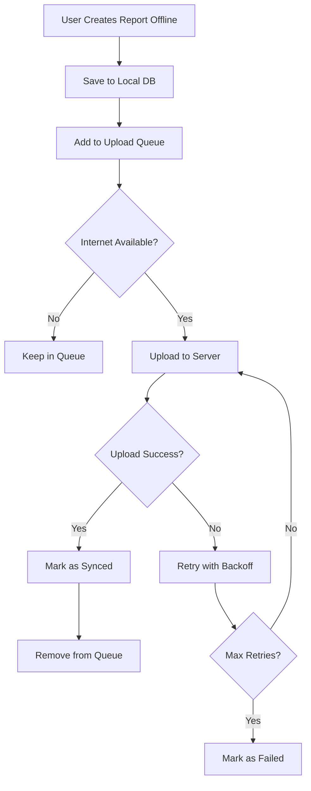
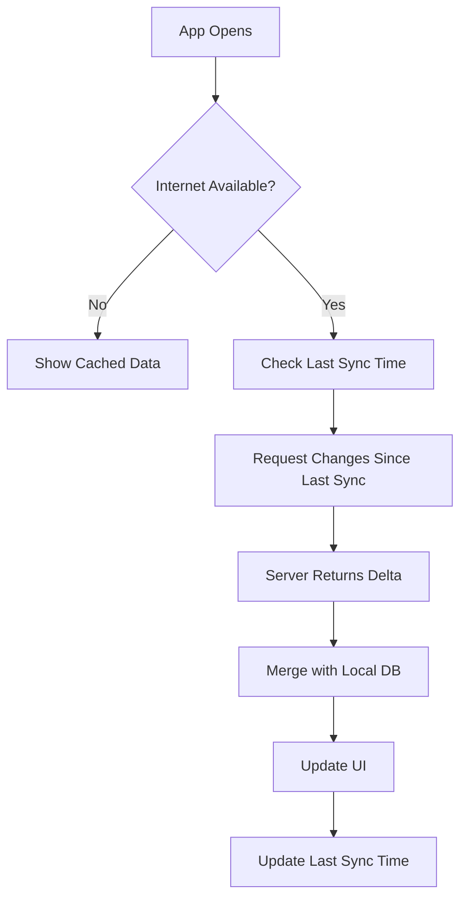

# 📱 Offline-First Architecture for CivicLens Mobile App

**Date:** October 19, 2025  
**Status:** Design & Implementation Guide  
**Priority:** 🔴 CRITICAL

---

## 🎯 Overview

CivicLens mobile app must support **offline-first** functionality, allowing users to:
- Create reports without internet connection
- View cached data offline
- Sync data when connection is restored
- Handle conflicts gracefully
- Provide seamless user experience

---

## 🏗️ Architecture Components

### 1. **Client-Side (Mobile App)**
```
┌─────────────────────────────────────┐
│         Mobile Application          │
├─────────────────────────────────────┤
│  UI Layer (React Native/Flutter)    │
├─────────────────────────────────────┤
│  Offline Queue Manager               │
│  - Pending Actions Queue             │
│  - Retry Logic                       │
│  - Conflict Resolution               │
├─────────────────────────────────────┤
│  Local Database (SQLite/Realm)      │
│  - Reports (draft + synced)          │
│  - User Profile                      │
│  - Categories/Departments            │
│  - Media Files (photos)              │
├─────────────────────────────────────┤
│  Sync Engine                         │
│  - Upload Queue                      │
│  - Download Queue                    │
│  - Conflict Detector                 │
└─────────────────────────────────────┘
```

### 2. **Server-Side (Backend API)**
```
┌─────────────────────────────────────┐
│         Backend API                  │
├─────────────────────────────────────┤
│  Sync Endpoints                      │
│  - Batch Upload                      │
│  - Incremental Download              │
│  - Conflict Resolution               │
├─────────────────────────────────────┤
│  Sync Metadata                       │
│  - Last Sync Timestamp               │
│  - Client Sync State                 │
│  - Conflict Log                      │
├─────────────────────────────────────┤
│  Queue Processing                    │
│  - Async Report Processing           │
│  - Media Upload Handling             │
│  - Notification Dispatch             │
└─────────────────────────────────────┘
```

---

## 📊 Data Sync Strategy

### Sync Types

#### 1. **Full Sync** (First Time / After Long Offline)
```
Mobile → Server: "Give me everything since timestamp 0"
Server → Mobile: All user data + metadata
Mobile: Store in local DB
```

#### 2. **Incremental Sync** (Regular Updates)
```
Mobile → Server: "Give me changes since last_sync_timestamp"
Server → Mobile: Only changed data
Mobile: Merge with local DB
```

#### 3. **Upload Sync** (Offline Actions)
```
Mobile → Server: Batch of pending actions
Server: Process each action
Server → Mobile: Success/Failure for each
Mobile: Update local DB, remove from queue
```

---

## 🔄 Sync Flow

### Upload Flow (Mobile → Server)



### Download Flow (Server → Mobile)



---

## 🗄️ Database Schema

### Mobile Local Database (SQLite)

```sql
-- Reports Table (with sync metadata)
CREATE TABLE reports (
    id TEXT PRIMARY KEY,              -- UUID (client-generated)
    server_id INTEGER,                -- Server ID (after sync)
    title TEXT NOT NULL,
    description TEXT,
    category TEXT,
    severity TEXT,
    latitude REAL,
    longitude REAL,
    address TEXT,
    media_paths TEXT,                 -- JSON array of local file paths
    status TEXT DEFAULT 'draft',      -- draft, pending_sync, synced, failed
    sync_status TEXT DEFAULT 'pending', -- pending, syncing, synced, failed
    sync_attempts INTEGER DEFAULT 0,
    last_sync_attempt TIMESTAMP,
    created_at TIMESTAMP DEFAULT CURRENT_TIMESTAMP,
    updated_at TIMESTAMP DEFAULT CURRENT_TIMESTAMP,
    synced_at TIMESTAMP,
    conflict_version INTEGER DEFAULT 1
);

-- Sync Queue Table
CREATE TABLE sync_queue (
    id INTEGER PRIMARY KEY AUTOINCREMENT,
    action_type TEXT NOT NULL,        -- create_report, update_report, etc.
    entity_type TEXT NOT NULL,        -- report, profile, etc.
    entity_id TEXT NOT NULL,          -- Local entity ID
    payload TEXT NOT NULL,            -- JSON payload
    priority INTEGER DEFAULT 0,       -- Higher = more important
    retry_count INTEGER DEFAULT 0,
    max_retries INTEGER DEFAULT 3,
    status TEXT DEFAULT 'pending',    -- pending, processing, success, failed
    error_message TEXT,
    created_at TIMESTAMP DEFAULT CURRENT_TIMESTAMP,
    last_attempt TIMESTAMP
);

-- Sync Metadata Table
CREATE TABLE sync_metadata (
    key TEXT PRIMARY KEY,
    value TEXT NOT NULL,
    updated_at TIMESTAMP DEFAULT CURRENT_TIMESTAMP
);

-- Media Files Table
CREATE TABLE media_files (
    id TEXT PRIMARY KEY,              -- UUID
    report_id TEXT NOT NULL,
    local_path TEXT NOT NULL,
    server_url TEXT,                  -- After upload
    file_size INTEGER,
    mime_type TEXT,
    upload_status TEXT DEFAULT 'pending', -- pending, uploading, uploaded, failed
    created_at TIMESTAMP DEFAULT CURRENT_TIMESTAMP
);
```

### Server Database Additions

```sql
-- Client Sync State Table
CREATE TABLE client_sync_state (
    id SERIAL PRIMARY KEY,
    user_id INTEGER NOT NULL REFERENCES users(id) ON DELETE CASCADE,
    device_id VARCHAR(255) NOT NULL,  -- Unique device identifier
    last_sync_timestamp TIMESTAMP WITH TIME ZONE,
    last_upload_timestamp TIMESTAMP WITH TIME ZONE,
    last_download_timestamp TIMESTAMP WITH TIME ZONE,
    sync_version INTEGER DEFAULT 1,
    device_info JSONB,
    created_at TIMESTAMP WITH TIME ZONE DEFAULT NOW(),
    updated_at TIMESTAMP WITH TIME ZONE DEFAULT NOW(),
    UNIQUE(user_id, device_id)
);

-- Sync Conflicts Table
CREATE TABLE sync_conflicts (
    id SERIAL PRIMARY KEY,
    user_id INTEGER NOT NULL REFERENCES users(id),
    device_id VARCHAR(255) NOT NULL,
    entity_type VARCHAR(50) NOT NULL, -- report, profile, etc.
    entity_id INTEGER NOT NULL,
    client_version JSONB NOT NULL,    -- Client's version of data
    server_version JSONB NOT NULL,    -- Server's version of data
    resolution_strategy VARCHAR(50),  -- server_wins, client_wins, merge
    resolved BOOLEAN DEFAULT FALSE,
    resolved_at TIMESTAMP WITH TIME ZONE,
    created_at TIMESTAMP WITH TIME ZONE DEFAULT NOW()
);

-- Offline Actions Log
CREATE TABLE offline_actions_log (
    id SERIAL PRIMARY KEY,
    user_id INTEGER NOT NULL REFERENCES users(id),
    device_id VARCHAR(255) NOT NULL,
    action_type VARCHAR(50) NOT NULL,
    entity_type VARCHAR(50) NOT NULL,
    entity_id VARCHAR(255) NOT NULL,  -- Client-side ID
    payload JSONB NOT NULL,
    processed BOOLEAN DEFAULT FALSE,
    processed_at TIMESTAMP WITH TIME ZONE,
    result JSONB,
    created_at TIMESTAMP WITH TIME ZONE DEFAULT NOW()
);
```

---

## 🔌 API Endpoints for Sync

### 1. **Batch Upload Endpoint**
```http
POST /api/v1/sync/upload
Authorization: Bearer <token>
Content-Type: application/json

{
  "device_id": "abc-123-def-456",
  "last_sync_timestamp": "2025-10-19T10:00:00Z",
  "actions": [
    {
      "client_id": "uuid-1",
      "action_type": "create_report",
      "entity_type": "report",
      "timestamp": "2025-10-19T09:30:00Z",
      "data": {
        "title": "Pothole on Main Street",
        "description": "Large pothole",
        "category": "roads",
        "latitude": 23.3441,
        "longitude": 85.3096,
        "media_ids": ["media-uuid-1", "media-uuid-2"]
      }
    },
    {
      "client_id": "uuid-2",
      "action_type": "update_profile",
      "entity_type": "user",
      "timestamp": "2025-10-19T09:45:00Z",
      "data": {
        "full_name": "Updated Name"
      }
    }
  ]
}

Response:
{
  "success": true,
  "results": [
    {
      "client_id": "uuid-1",
      "status": "success",
      "server_id": 123,
      "message": "Report created successfully"
    },
    {
      "client_id": "uuid-2",
      "status": "success",
      "message": "Profile updated"
    }
  ],
  "conflicts": [],
  "sync_timestamp": "2025-10-19T10:30:00Z"
}
```

### 2. **Incremental Download Endpoint**
```http
GET /api/v1/sync/download?since=2025-10-19T10:00:00Z&device_id=abc-123
Authorization: Bearer <token>

Response:
{
  "success": true,
  "data": {
    "reports": [
      {
        "id": 124,
        "title": "New Report",
        "status": "received",
        "updated_at": "2025-10-19T10:15:00Z"
      }
    ],
    "tasks": [
      {
        "id": 45,
        "report_id": 120,
        "status": "in_progress",
        "updated_at": "2025-10-19T10:20:00Z"
      }
    ],
    "notifications": [
      {
        "id": 67,
        "message": "Your report was acknowledged",
        "created_at": "2025-10-19T10:25:00Z"
      }
    ]
  },
  "sync_timestamp": "2025-10-19T10:30:00Z",
  "has_more": false
}
```

### 3. **Media Upload Endpoint**
```http
POST /api/v1/sync/media
Authorization: Bearer <token>
Content-Type: multipart/form-data

{
  "device_id": "abc-123",
  "media_id": "media-uuid-1",
  "report_client_id": "uuid-1",
  "file": <binary data>
}

Response:
{
  "success": true,
  "media_id": "media-uuid-1",
  "server_url": "https://cdn.civiclens.com/media/abc123.jpg",
  "thumbnail_url": "https://cdn.civiclens.com/media/abc123_thumb.jpg"
}
```

### 4. **Conflict Resolution Endpoint**
```http
POST /api/v1/sync/resolve-conflict
Authorization: Bearer <token>

{
  "conflict_id": 12,
  "resolution": "client_wins",  // or "server_wins" or "merge"
  "merged_data": { ... }  // If resolution is "merge"
}

Response:
{
  "success": true,
  "resolved_data": { ... }
}
```

### 5. **Sync Status Endpoint**
```http
GET /api/v1/sync/status?device_id=abc-123
Authorization: Bearer <token>

Response:
{
  "device_id": "abc-123",
  "last_sync": "2025-10-19T10:30:00Z",
  "pending_uploads": 0,
  "pending_downloads": 2,
  "conflicts": 0,
  "sync_health": "good"
}
```

---

## 🔄 Conflict Resolution Strategies

### 1. **Server Wins** (Default for most cases)
- Server data is always correct
- Client data is discarded
- Use for: System-generated data, status updates

### 2. **Client Wins** (User-initiated changes)
- Client data overwrites server
- Use for: User profile updates, draft reports

### 3. **Last Write Wins** (Timestamp-based)
- Compare timestamps
- Most recent change wins
- Use for: Simple data updates

### 4. **Merge** (Complex data)
- Combine both versions intelligently
- Use for: Rich text fields, arrays

### 5. **Manual Resolution** (Critical conflicts)
- Show both versions to user
- Let user choose or merge
- Use for: Important data conflicts

---

## 📱 Mobile App Implementation Guide

### Sync Manager (React Native Example)

```javascript
// SyncManager.js
class SyncManager {
  constructor() {
    this.syncQueue = [];
    this.isSyncing = false;
    this.lastSyncTimestamp = null;
  }

  // Add action to sync queue
  async queueAction(actionType, entityType, data) {
    const action = {
      client_id: uuid.v4(),
      action_type: actionType,
      entity_type: entityType,
      timestamp: new Date().toISOString(),
      data: data
    };

    await db.syncQueue.insert(action);
    this.syncQueue.push(action);

    // Try to sync immediately if online
    if (await this.isOnline()) {
      this.startSync();
    }
  }

  // Start sync process
  async startSync() {
    if (this.isSyncing) return;
    this.isSyncing = true;

    try {
      // 1. Upload pending actions
      await this.uploadPendingActions();

      // 2. Download new data
      await this.downloadNewData();

      // 3. Resolve conflicts
      await this.resolveConflicts();

      // 4. Update last sync timestamp
      this.lastSyncTimestamp = new Date().toISOString();
      await this.saveLastSyncTimestamp();

    } catch (error) {
      console.error('Sync failed:', error);
    } finally {
      this.isSyncing = false;
    }
  }

  // Upload pending actions
  async uploadPendingActions() {
    const pendingActions = await db.syncQueue.findPending();

    if (pendingActions.length === 0) return;

    const response = await api.post('/sync/upload', {
      device_id: await this.getDeviceId(),
      last_sync_timestamp: this.lastSyncTimestamp,
      actions: pendingActions
    });

    // Process results
    for (const result of response.results) {
      if (result.status === 'success') {
        await db.syncQueue.markSynced(result.client_id);
        await this.updateLocalEntity(result);
      } else {
        await db.syncQueue.incrementRetry(result.client_id);
      }
    }
  }

  // Download new data
  async downloadNewData() {
    const response = await api.get('/sync/download', {
      params: {
        since: this.lastSyncTimestamp,
        device_id: await this.getDeviceId()
      }
    });

    // Merge with local database
    await this.mergeDownloadedData(response.data);
  }

  // Check online status
  async isOnline() {
    return NetInfo.fetch().then(state => state.isConnected);
  }
}

export default new SyncManager();
```

### Report Creation (Offline-First)

```javascript
// CreateReport.js
async function createReport(reportData) {
  // 1. Generate client-side UUID
  const clientId = uuid.v4();

  // 2. Save to local database immediately
  await db.reports.insert({
    id: clientId,
    ...reportData,
    status: 'draft',
    sync_status: 'pending',
    created_at: new Date().toISOString()
  });

  // 3. Save media files locally
  for (const media of reportData.media) {
    await saveMediaLocally(clientId, media);
  }

  // 4. Add to sync queue
  await SyncManager.queueAction('create_report', 'report', {
    client_id: clientId,
    ...reportData
  });

  // 5. Show success to user immediately
  showToast('Report created! Will sync when online.');

  return clientId;
}
```

---

## 🎯 Best Practices

### 1. **Always Save Locally First**
```javascript
// ✅ Good
await saveToLocalDB(data);
await queueForSync(data);
showSuccess();

// ❌ Bad
await saveToServer(data);  // Fails if offline
await saveToLocalDB(data);
```

### 2. **Use UUIDs for Client-Generated IDs**
```javascript
// ✅ Good
const id = uuid.v4();  // Works offline

// ❌ Bad
const id = await getNextIdFromServer();  // Requires internet
```

### 3. **Implement Exponential Backoff**
```javascript
const retryDelays = [1000, 2000, 5000, 10000, 30000];  // ms
```

### 4. **Show Sync Status to User**
```javascript
<SyncIndicator 
  status={syncStatus}  // synced, syncing, pending, offline
  pendingCount={pendingActions.length}
/>
```

### 5. **Handle Media Separately**
```javascript
// Upload media after report is synced
// Use background upload queue
// Compress images before upload
```

---

## 🧪 Testing Offline Functionality

### Test Scenarios

1. **Create Report Offline**
   - Turn off internet
   - Create report with photos
   - Verify saved locally
   - Turn on internet
   - Verify syncs automatically

2. **Update Profile Offline**
   - Go offline
   - Update profile
   - Go online
   - Verify changes synced

3. **Conflict Resolution**
   - Edit same report on two devices
   - Sync both
   - Verify conflict detected
   - Resolve conflict

4. **Long Offline Period**
   - Stay offline for days
   - Create multiple reports
   - Go online
   - Verify all sync correctly

5. **Network Interruption**
   - Start sync
   - Interrupt network mid-sync
   - Verify retry logic works

---

## 📊 Monitoring & Analytics

### Metrics to Track

1. **Sync Success Rate**
   - % of successful syncs
   - Average sync time
   - Failed sync reasons

2. **Offline Usage**
   - Time spent offline
   - Actions performed offline
   - Data created offline

3. **Conflict Rate**
   - Number of conflicts
   - Conflict types
   - Resolution methods used

4. **Performance**
   - Sync duration
   - Data transfer size
   - Battery impact

---

## 🚀 Implementation Priority

### Phase 1: Core Offline (Week 1)
- ✅ Local database setup
- ✅ Basic sync queue
- ✅ Upload endpoint
- ✅ Download endpoint

### Phase 2: Media Sync (Week 2)
- ✅ Media upload queue
- ✅ Background upload
- ✅ Image compression
- ✅ Thumbnail generation

### Phase 3: Conflict Resolution (Week 3)
- ✅ Conflict detection
- ✅ Resolution strategies
- ✅ User interface for conflicts

### Phase 4: Optimization (Week 4)
- ✅ Delta sync
- ✅ Batch operations
- ✅ Performance tuning
- ✅ Battery optimization

---

**This offline-first architecture ensures CivicLens works seamlessly whether users are online or offline, providing the best possible user experience!** 📱✨
